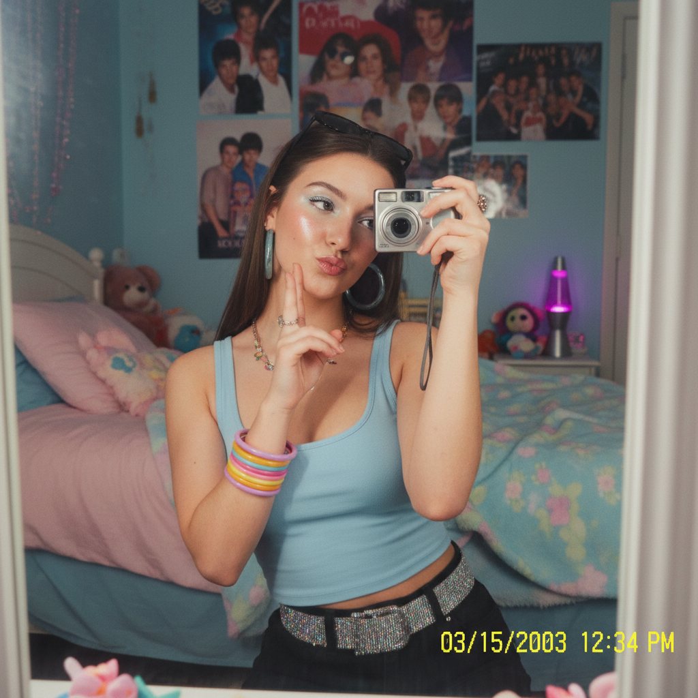

# 2000s Mirror Selfie Aesthetic

## Prompt

```text
Create a dreamy early-2000s mirror selfie aesthetic. Harsh compact-camera flash, glossy highlights, pastel bedroom details, chunky accessories, playful pose, nostalgic vibe, vertical 2:3 composition, ultra detailed.
```

## Model
- gemini-2.5-flash-image

## Suggested Settings
- Aspect Ratio: 2:3
- Style / Mood: Y2K nostalgia, dreamy, playful
- Lighting: Harsh compact-camera flash with glossy highlights
- Composition: Vertical portrait, mirror-centered framing
- Detail Level: high

## Copy-ready Prompt

```text
Create a dreamy early-2000s mirror selfie aesthetic. Harsh compact-camera flash, glossy highlights, pastel bedroom details, chunky accessories, playful pose, nostalgic vibe, vertical 2:3 composition, ultra detailed.

Rendering requirements:
- Aspect ratio: 2:3
- Style/Mood: Y2K nostalgia, dreamy, playful
- Lighting: Harsh compact-camera flash with glossy highlights
- Composition: Vertical portrait, mirror-centered framing
- Detail level: high

Please keep strong consistency with the above settings.
```

## Image

