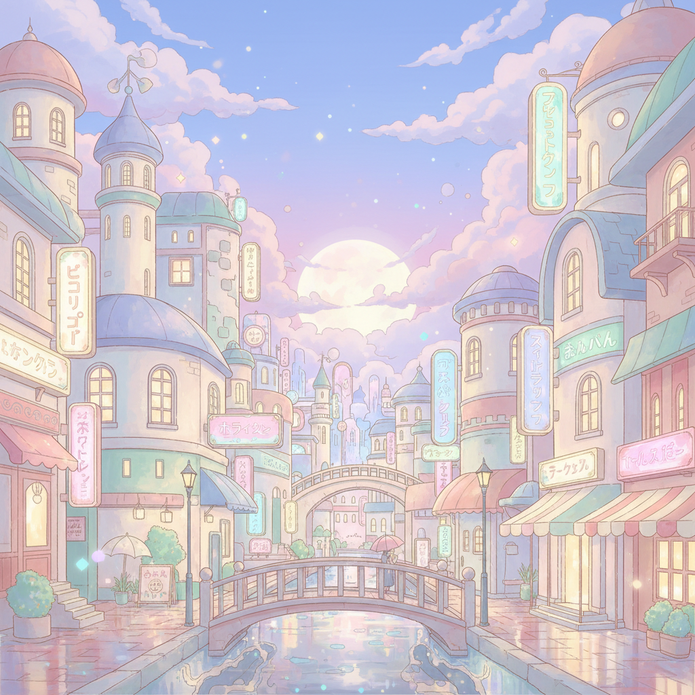

# Dreamy Pastel Anime City

## Prompt

```text
Dreamy anime-inspired pastel city scene at dusk, glowing signage, soft clouds, reflective streets, cozy magical atmosphere, highly detailed illustration style, vertical Pinterest ratio.
```

## Model
- gemini-2.5-flash-image

## Suggested Settings
- Aspect Ratio: 2:3
- Style / Mood: Pastel anime, dreamy, magical city vibe
- Lighting: Dusk ambient light with neon glow accents
- Composition: Vertical city scene with depth and leading lines
- Detail Level: high

## Copy-ready Prompt

```text
Dreamy anime-inspired pastel city scene at dusk, glowing signage, soft clouds, reflective streets, cozy magical atmosphere, highly detailed illustration style, vertical Pinterest ratio.

Rendering requirements:
- Aspect ratio: 2:3
- Style/Mood: Pastel anime, dreamy, magical city vibe
- Lighting: Dusk ambient light with neon glow accents
- Composition: Vertical city scene with depth and leading lines
- Detail level: high

Please keep strong consistency with the above settings.
```

## Image

