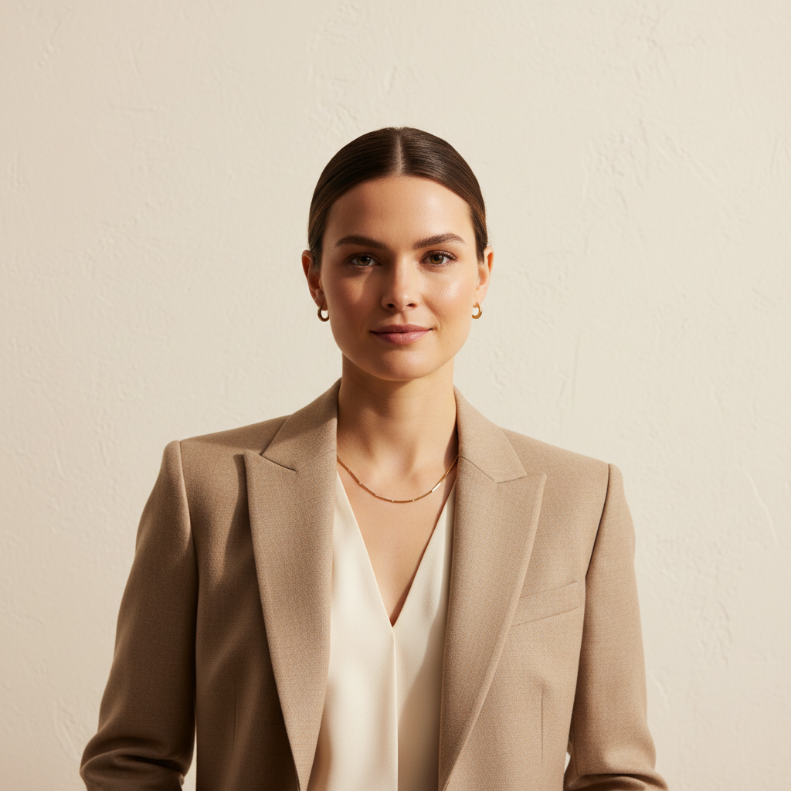

# Quiet Luxury Workwear Mood

## Prompt

```text
Editorial quiet-luxury workwear portrait, tailored beige blazer, minimal gold jewelry, clean background, premium texture detail, modern sophistication. Aspect ratio 2:3. Style and mood: Minimal luxury, modern professional. Lighting: Soft studio key light with subtle shadow falloff. Composition: Vertical half-body editorial framing. Detail level: high. High quality output, clean details.
```

## Model
- gemini-2.5-flash-image

## Suggested Settings
- Aspect Ratio: 2:3
- Style / Mood: Minimal luxury, modern professional
- Lighting: Soft studio key light with subtle shadow falloff
- Composition: Vertical half-body editorial framing
- Detail Level: high

## Copy-ready Prompt

```text
Editorial quiet-luxury workwear portrait, tailored beige blazer, minimal gold jewelry, clean background, premium texture detail, modern sophistication. Aspect ratio 2:3. Style and mood: Minimal luxury, modern professional. Lighting: Soft studio key light with subtle shadow falloff. Composition: Vertical half-body editorial framing. Detail level: high. High quality output, clean details.

Rendering requirements:
- Aspect ratio: 2:3
- Style/Mood: Minimal luxury, modern professional
- Lighting: Soft studio key light with subtle shadow falloff
- Composition: Vertical half-body editorial framing
- Detail level: high

Please keep strong consistency with the above settings.
```

## Image

