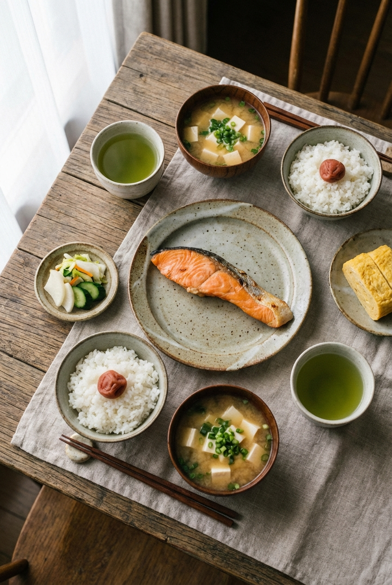

# Japanese Breakfast Plating

## Prompt

```text
Top-down Japanese breakfast set styling, ceramic bowls, grilled salmon, miso soup, steamed rice, natural table textures, refined food editorial look. Aspect ratio 2:3. Style and mood: Clean, calm, refined culinary aesthetic. Lighting: Soft morning window light. Composition: Vertical top-down flatlay composition. Detail level: high. High quality output, clean details.
```

## Model
- gemini-3-pro-image-preview

## Suggested Settings
- Aspect Ratio: 2:3
- Style / Mood: Clean, calm, refined culinary aesthetic
- Lighting: Soft morning window light
- Composition: Vertical top-down flatlay composition
- Detail Level: high

## Copy-ready Prompt

```text
Top-down Japanese breakfast set styling, ceramic bowls, grilled salmon, miso soup, steamed rice, natural table textures, refined food editorial look. Aspect ratio 2:3. Style and mood: Clean, calm, refined culinary aesthetic. Lighting: Soft morning window light. Composition: Vertical top-down flatlay composition. Detail level: high. High quality output, clean details.

Rendering requirements:
- Aspect ratio: 2:3
- Style/Mood: Clean, calm, refined culinary aesthetic
- Lighting: Soft morning window light
- Composition: Vertical top-down flatlay composition
- Detail level: high

Please keep strong consistency with the above settings.
```

## Image

