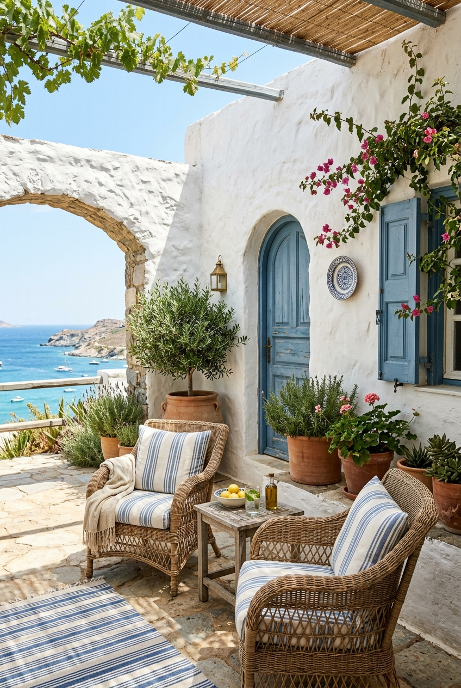

# Coastal Mediterranean Patio

## Prompt

```text
Coastal Mediterranean patio inspiration, white stucco walls, blue accents, terracotta planters, woven chairs, breezy summer atmosphere. Aspect ratio 2:3. Style and mood: Airy coastal Mediterranean. Lighting: Bright natural sunlight with soft shadows. Composition: Vertical lifestyle interior-exterior shot. Detail level: high. High quality output, clean details.
```

## Model
- gemini-3.1-flash-image-preview

## Suggested Settings
- Aspect Ratio: 2:3
- Style / Mood: Airy coastal Mediterranean
- Lighting: Bright natural sunlight with soft shadows
- Composition: Vertical lifestyle interior-exterior shot
- Detail Level: high

## Copy-ready Prompt

```text
Coastal Mediterranean patio inspiration, white stucco walls, blue accents, terracotta planters, woven chairs, breezy summer atmosphere. Aspect ratio 2:3. Style and mood: Airy coastal Mediterranean. Lighting: Bright natural sunlight with soft shadows. Composition: Vertical lifestyle interior-exterior shot. Detail level: high. High quality output, clean details.

Rendering requirements:
- Aspect ratio: 2:3
- Style/Mood: Airy coastal Mediterranean
- Lighting: Bright natural sunlight with soft shadows
- Composition: Vertical lifestyle interior-exterior shot
- Detail level: high

Please keep strong consistency with the above settings.
```

## Image

