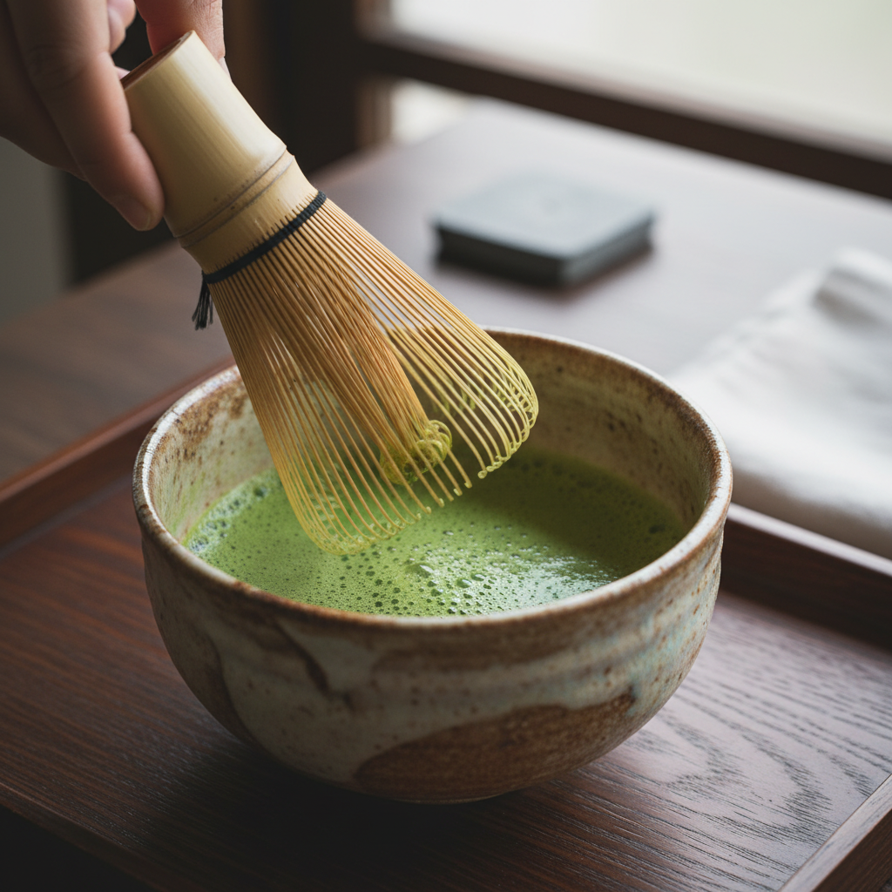

# Matcha Ceremony Close-up

## Prompt

```text
Elegant matcha whisking close-up, ceramic chawan, bamboo whisk texture, minimal Japanese tea ritual scene, calming atmosphere, premium detail. Aspect ratio 2:3. Style and mood: Calm ritual, zen minimalism. Lighting: Soft diffused daylight. Composition: Vertical close-up with tactile details. Detail level: high. High quality output, clean details.
```

## Model
- gemini-2.5-flash-image

## Suggested Settings
- Aspect Ratio: 2:3
- Style / Mood: Calm ritual, zen minimalism
- Lighting: Soft diffused daylight
- Composition: Vertical close-up with tactile details
- Detail Level: high

## Copy-ready Prompt

```text
Elegant matcha whisking close-up, ceramic chawan, bamboo whisk texture, minimal Japanese tea ritual scene, calming atmosphere, premium detail. Aspect ratio 2:3. Style and mood: Calm ritual, zen minimalism. Lighting: Soft diffused daylight. Composition: Vertical close-up with tactile details. Detail level: high. High quality output, clean details.

Rendering requirements:
- Aspect ratio: 2:3
- Style/Mood: Calm ritual, zen minimalism
- Lighting: Soft diffused daylight
- Composition: Vertical close-up with tactile details
- Detail level: high

Please keep strong consistency with the above settings.
```

## Image

