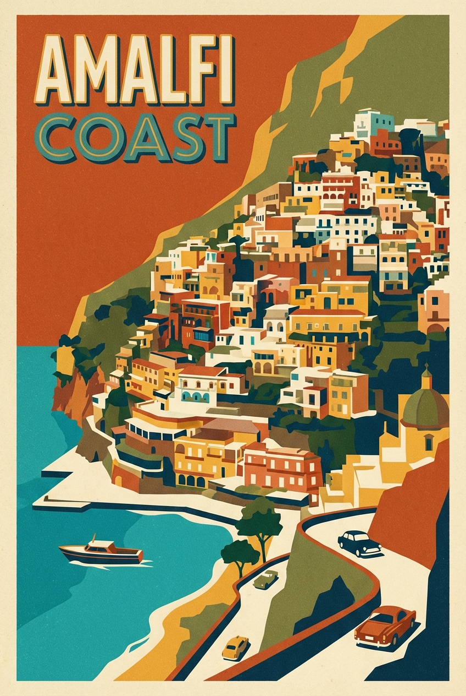

# Retro Italy Travel Poster

## Prompt

```text
Vintage-inspired travel poster illustration of Amalfi Coast, bold shapes, grain texture, limited color palette, graphic design style. Aspect ratio 2:3. Style and mood: Retro graphic, playful nostalgic. Lighting: Flat poster lighting aesthetic. Composition: Vertical poster layout with strong focal landmark. Detail level: high. High quality output, clean details.
```

## Model
- gemini-3-pro-image-preview

## Suggested Settings
- Aspect Ratio: 2:3
- Style / Mood: Retro graphic, playful nostalgic
- Lighting: Flat poster lighting aesthetic
- Composition: Vertical poster layout with strong focal landmark
- Detail Level: high

## Copy-ready Prompt

```text
Vintage-inspired travel poster illustration of Amalfi Coast, bold shapes, grain texture, limited color palette, graphic design style. Aspect ratio 2:3. Style and mood: Retro graphic, playful nostalgic. Lighting: Flat poster lighting aesthetic. Composition: Vertical poster layout with strong focal landmark. Detail level: high. High quality output, clean details.

Rendering requirements:
- Aspect ratio: 2:3
- Style/Mood: Retro graphic, playful nostalgic
- Lighting: Flat poster lighting aesthetic
- Composition: Vertical poster layout with strong focal landmark
- Detail level: high

Please keep strong consistency with the above settings.
```

## Image

