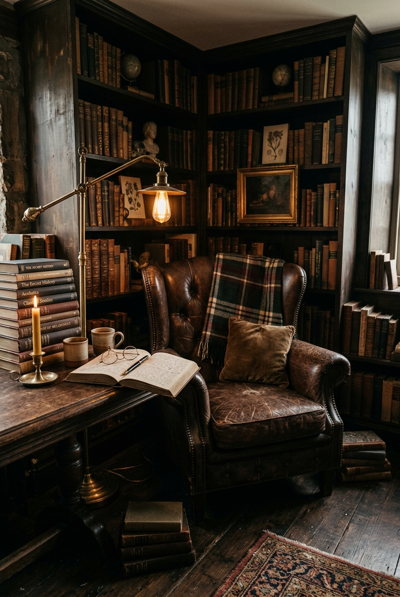

# Dark Academia Library Corner

## Prompt

```text
Dark academia reading corner with vintage armchair, stacked books, brass lamp, moody tones, old wood textures, cinematic still-life interior. Aspect ratio 2:3. Style and mood: Moody, intellectual, vintage. Lighting: Warm tungsten lamp mixed with low ambient light. Composition: Vertical corner composition with depth. Detail level: high. High quality output, clean details.
```

## Model
- gemini-3.1-flash-image-preview

## Suggested Settings
- Aspect Ratio: 2:3
- Style / Mood: Moody, intellectual, vintage
- Lighting: Warm tungsten lamp mixed with low ambient light
- Composition: Vertical corner composition with depth
- Detail Level: high

## Copy-ready Prompt

```text
Dark academia reading corner with vintage armchair, stacked books, brass lamp, moody tones, old wood textures, cinematic still-life interior. Aspect ratio 2:3. Style and mood: Moody, intellectual, vintage. Lighting: Warm tungsten lamp mixed with low ambient light. Composition: Vertical corner composition with depth. Detail level: high. High quality output, clean details.

Rendering requirements:
- Aspect ratio: 2:3
- Style/Mood: Moody, intellectual, vintage
- Lighting: Warm tungsten lamp mixed with low ambient light
- Composition: Vertical corner composition with depth
- Detail level: high

Please keep strong consistency with the above settings.
```

## Image

