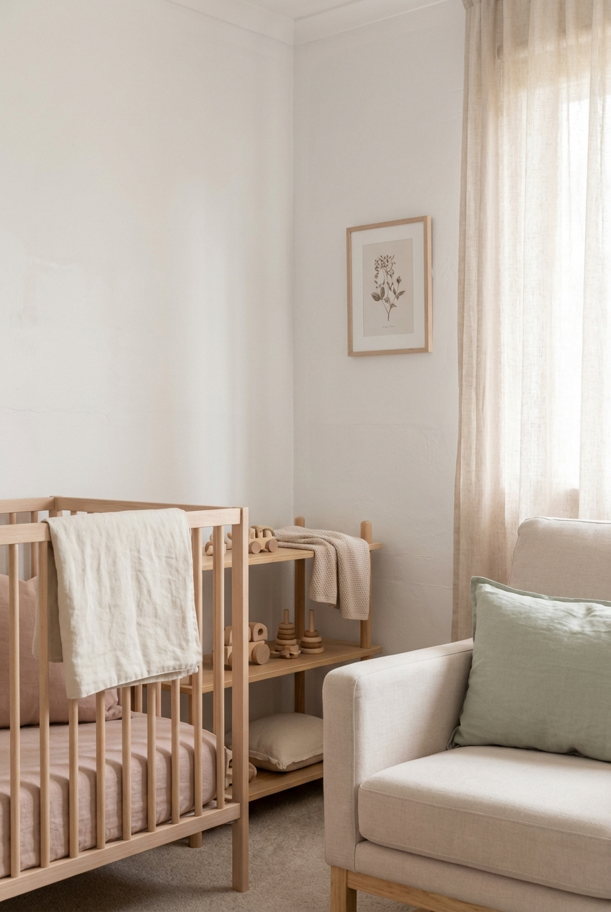

# Soft Nordic Baby Room

## Prompt

```text
Soft Nordic nursery room inspiration, pastel neutral palette, wooden toys, linen textiles, minimal decor, cozy and gentle mood. Aspect ratio 2:3. Style and mood: Gentle, minimal, warm family interior. Lighting: Soft daylight with low contrast. Composition: Vertical room vignette composition. Detail level: high. High quality output, clean details.
```

## Model
- gemini-3-pro-image-preview

## Suggested Settings
- Aspect Ratio: 2:3
- Style / Mood: Gentle, minimal, warm family interior
- Lighting: Soft daylight with low contrast
- Composition: Vertical room vignette composition
- Detail Level: high

## Copy-ready Prompt

```text
Soft Nordic nursery room inspiration, pastel neutral palette, wooden toys, linen textiles, minimal decor, cozy and gentle mood. Aspect ratio 2:3. Style and mood: Gentle, minimal, warm family interior. Lighting: Soft daylight with low contrast. Composition: Vertical room vignette composition. Detail level: high. High quality output, clean details.

Rendering requirements:
- Aspect ratio: 2:3
- Style/Mood: Gentle, minimal, warm family interior
- Lighting: Soft daylight with low contrast
- Composition: Vertical room vignette composition
- Detail level: high

Please keep strong consistency with the above settings.
```

## Image

