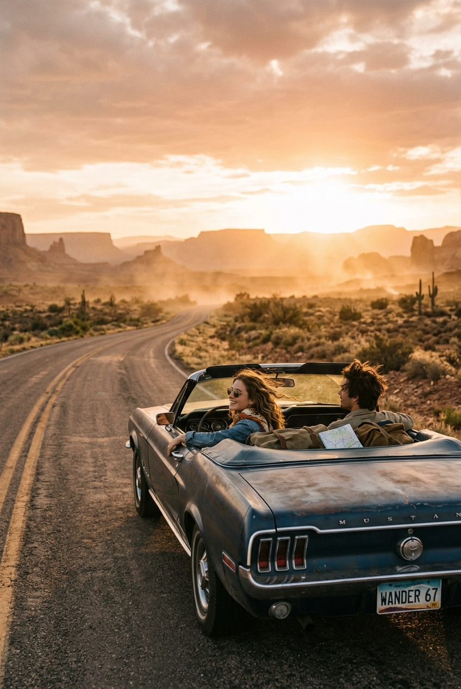

# Desert Road Trip Film Mood

## Prompt

```text
Cinematic desert road trip scene, vintage convertible, dusty horizon, golden sunset haze, 35mm film tone, nostalgic wanderlust mood. Aspect ratio 2:3. Style and mood: Wanderlust cinematic nostalgia. Lighting: Golden sunset backlight with haze. Composition: Vertical travel storytelling frame. Detail level: high. High quality output, clean details.
```

## Model
- gemini-3.1-flash-image-preview

## Suggested Settings
- Aspect Ratio: 2:3
- Style / Mood: Wanderlust cinematic nostalgia
- Lighting: Golden sunset backlight with haze
- Composition: Vertical travel storytelling frame
- Detail Level: high

## Copy-ready Prompt

```text
Cinematic desert road trip scene, vintage convertible, dusty horizon, golden sunset haze, 35mm film tone, nostalgic wanderlust mood. Aspect ratio 2:3. Style and mood: Wanderlust cinematic nostalgia. Lighting: Golden sunset backlight with haze. Composition: Vertical travel storytelling frame. Detail level: high. High quality output, clean details.

Rendering requirements:
- Aspect ratio: 2:3
- Style/Mood: Wanderlust cinematic nostalgia
- Lighting: Golden sunset backlight with haze
- Composition: Vertical travel storytelling frame
- Detail level: high

Please keep strong consistency with the above settings.
```

## Image

