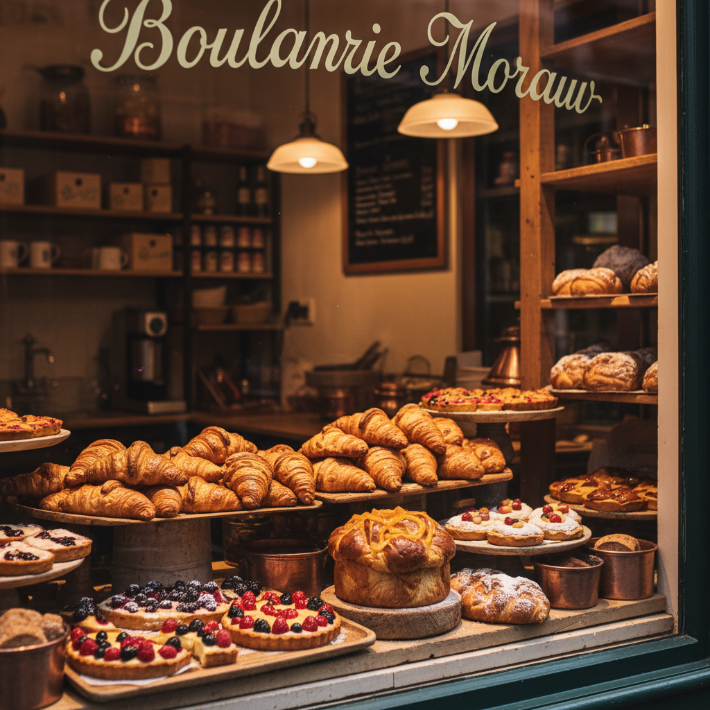

# French Bakery Window Mood

## Prompt

```text
Parisian bakery window display, flaky croissants and tarts, warm inviting ambiance, artisan textures, boutique food photography style. Aspect ratio 2:3. Style and mood: Warm artisan European cafe vibe. Lighting: Warm window light with soft shadow. Composition: Vertical storefront detail composition. Detail level: high. High quality output, clean details.
```

## Model
- gemini-2.5-flash-image

## Suggested Settings
- Aspect Ratio: 2:3
- Style / Mood: Warm artisan European cafe vibe
- Lighting: Warm window light with soft shadow
- Composition: Vertical storefront detail composition
- Detail Level: high

## Copy-ready Prompt

```text
Parisian bakery window display, flaky croissants and tarts, warm inviting ambiance, artisan textures, boutique food photography style. Aspect ratio 2:3. Style and mood: Warm artisan European cafe vibe. Lighting: Warm window light with soft shadow. Composition: Vertical storefront detail composition. Detail level: high. High quality output, clean details.

Rendering requirements:
- Aspect ratio: 2:3
- Style/Mood: Warm artisan European cafe vibe
- Lighting: Warm window light with soft shadow
- Composition: Vertical storefront detail composition
- Detail level: high

Please keep strong consistency with the above settings.
```

## Image

