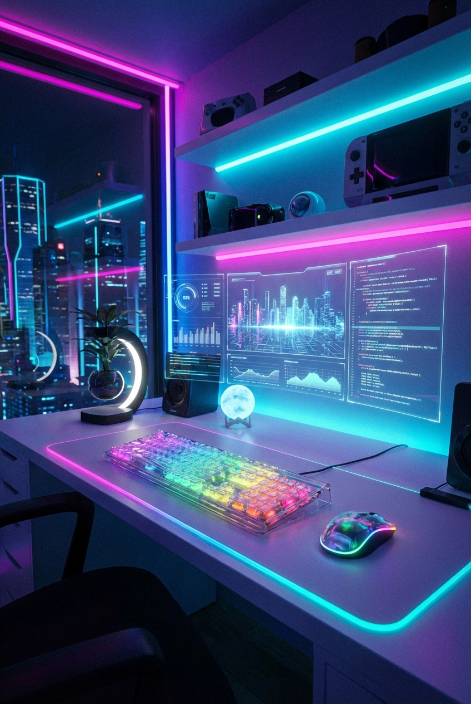

# Sci‑Fi Desk Setup at Night

## Prompt

```text
Futuristic desk setup at night, RGB ambient glow, transparent keyboard, holographic UI vibes, clean modern workspace composition. Aspect ratio 2:3. Style and mood: Futuristic clean tech aesthetic. Lighting: Neon accent practical lights with dark ambient base. Composition: Vertical desk scene with layered depth. Detail level: high. High quality output, clean details.
```

## Model
- gemini-3-pro-image-preview

## Suggested Settings
- Aspect Ratio: 2:3
- Style / Mood: Futuristic clean tech aesthetic
- Lighting: Neon accent practical lights with dark ambient base
- Composition: Vertical desk scene with layered depth
- Detail Level: high

## Copy-ready Prompt

```text
Futuristic desk setup at night, RGB ambient glow, transparent keyboard, holographic UI vibes, clean modern workspace composition. Aspect ratio 2:3. Style and mood: Futuristic clean tech aesthetic. Lighting: Neon accent practical lights with dark ambient base. Composition: Vertical desk scene with layered depth. Detail level: high. High quality output, clean details.

Rendering requirements:
- Aspect ratio: 2:3
- Style/Mood: Futuristic clean tech aesthetic
- Lighting: Neon accent practical lights with dark ambient base
- Composition: Vertical desk scene with layered depth
- Detail level: high

Please keep strong consistency with the above settings.
```

## Image

