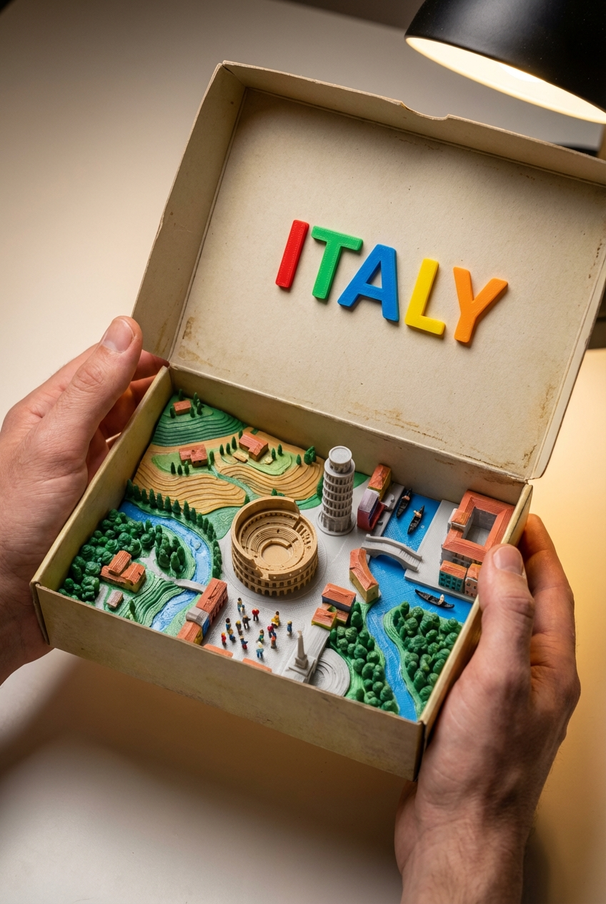

# An Ultra-realistic Top-down Photograph Of A

## Prompt

```text
An ultra-realistic top-down photograph of a 3D-printed diorama inside a beige cardboard box, with the lid being held open by two human hands. The interior of the box reveals a miniature landscape of [COUNTRY NAME], featuring iconic landmarks, terrain, buildings, rivers, vegetation, and crowds of tiny, detailed human figures. The diorama is filled with vibrant, geographically appropriate elements, all crafted in a tactile, toy-like style using matte 3D-printed textures with visible layer lines. At the top, the inside of the box lid displays the phrase “[COUNTRY NAME]” in large, colorful, raised plastic letters—each letter in a different bright color. The lighting is warm and cinematic, highlighting the textures and shadows to evoke a sense of realism and charm, as if the viewer is opening a magical miniature version of the natio Aspect ratio 2:3. Style and mood: High-quality AI visual inspiration. Lighting: Balanced cinematic lighting. Composition: Vertical Pinterest-friendly composition. Detail level: high. High quality output, clean details.
```

## Model
- gemini-3-pro-image-preview

## Suggested Settings
- Aspect Ratio: 2:3
- Style / Mood: High-quality AI visual inspiration
- Lighting: Balanced cinematic lighting
- Composition: Vertical Pinterest-friendly composition
- Detail Level: high

## Copy-ready Prompt

```text
An ultra-realistic top-down photograph of a 3D-printed diorama inside a beige cardboard box, with the lid being held open by two human hands. The interior of the box reveals a miniature landscape of [COUNTRY NAME], featuring iconic landmarks, terrain, buildings, rivers, vegetation, and crowds of tiny, detailed human figures. The diorama is filled with vibrant, geographically appropriate elements, all crafted in a tactile, toy-like style using matte 3D-printed textures with visible layer lines. At the top, the inside of the box lid displays the phrase “[COUNTRY NAME]” in large, colorful, raised plastic letters—each letter in a different bright color. The lighting is warm and cinematic, highlighting the textures and shadows to evoke a sense of realism and charm, as if the viewer is opening a magical miniature version of the natio Aspect ratio 2:3. Style and mood: High-quality AI visual inspiration. Lighting: Balanced cinematic lighting. Composition: Vertical Pinterest-friendly composition. Detail level: high. High quality output, clean details.

Rendering requirements:
- Aspect ratio: 2:3
- Style/Mood: High-quality AI visual inspiration
- Lighting: Balanced cinematic lighting
- Composition: Vertical Pinterest-friendly composition
- Detail level: high

Please keep strong consistency with the above settings.
```

## Image

