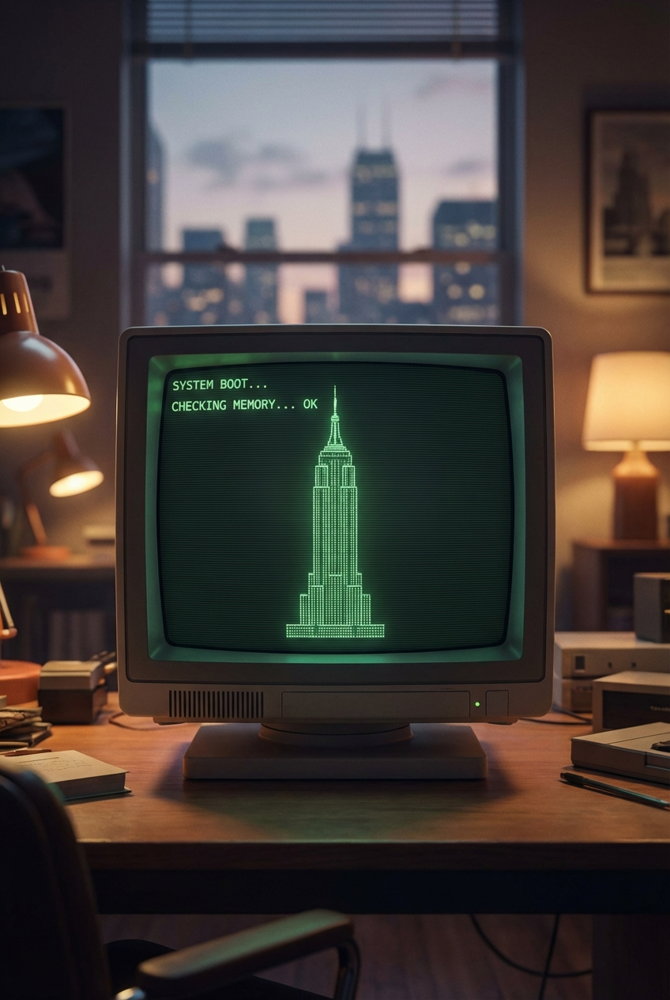

# Retro CRT Computer Boot Screen That

## Prompt

```text
Retro CRT computer boot screen that resolves into ASCII-art of NYC's tallest building Aspect ratio 2:3. Style and mood: High-quality AI visual inspiration. Lighting: Balanced cinematic lighting. Composition: Vertical Pinterest-friendly composition. Detail level: high. High quality output, clean details.
```

## Model
- gemini-3-pro-image-preview

## Suggested Settings
- Aspect Ratio: 2:3
- Style / Mood: High-quality AI visual inspiration
- Lighting: Balanced cinematic lighting
- Composition: Vertical Pinterest-friendly composition
- Detail Level: high

## Copy-ready Prompt

```text
Retro CRT computer boot screen that resolves into ASCII-art of NYC's tallest building Aspect ratio 2:3. Style and mood: High-quality AI visual inspiration. Lighting: Balanced cinematic lighting. Composition: Vertical Pinterest-friendly composition. Detail level: high. High quality output, clean details.

Rendering requirements:
- Aspect ratio: 2:3
- Style/Mood: High-quality AI visual inspiration
- Lighting: Balanced cinematic lighting
- Composition: Vertical Pinterest-friendly composition
- Detail level: high

Please keep strong consistency with the above settings.
```

## Image

