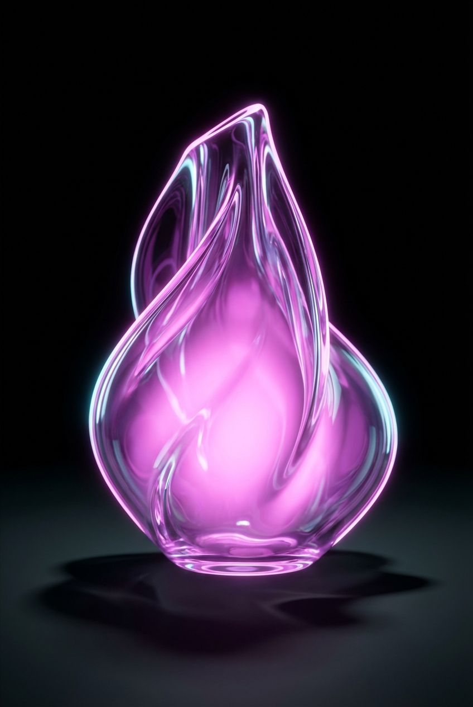

# Recreate This Image Using The Parameters

## Prompt

```text
Recreate this image using the parameters from the JSON provided. { "name": "Neon Glass Glow", "style": { "material": { "type": "glass", "transparency": 0.92, "reflectivity": 1.0, "refractionIndex": 1.6, "color": "#ff00ff", "emission": { "color": "#ff66ff", "intensity": 0.8 }, "surfaceFinish": "glossy", "bloom": true, "detail": "high" }, "outline": { "enabled": true, "color": "#ffccff", "width": 1.8 }, "lighting": { "type": "studio", "keyLightColor": "#ffffff", "keyLightIntensity": 1.0, "fillLightColor": "#9900ff", "fillLightIntensity": 0.7, "rimLightColor": "#00ffff", "rimLightIntensity": 0.7, "shadows": "crisp" }, "background": { "type": "solid", "color": "#000000" }, "render": { "shadows": true, "antiAliasing": true, "superSampling": "4x", "resolution": "high", "depthOfField": { "enabled": true, "focusDistance": 0.8, "blurAmount": 0.1 } } } } Aspect ratio 2:3. Style and mood: High-quality AI visual inspiration. Lighting: Balanced cinematic lighting. Composition: Vertical Pinterest-friendly composition. Detail level: high. High quality output, clean details.
```

## Model
- gemini-3-pro-image-preview

## Suggested Settings
- Aspect Ratio: 2:3
- Style / Mood: High-quality AI visual inspiration
- Lighting: Balanced cinematic lighting
- Composition: Vertical Pinterest-friendly composition
- Detail Level: high

## Copy-ready Prompt

```text
Recreate this image using the parameters from the JSON provided. { "name": "Neon Glass Glow", "style": { "material": { "type": "glass", "transparency": 0.92, "reflectivity": 1.0, "refractionIndex": 1.6, "color": "#ff00ff", "emission": { "color": "#ff66ff", "intensity": 0.8 }, "surfaceFinish": "glossy", "bloom": true, "detail": "high" }, "outline": { "enabled": true, "color": "#ffccff", "width": 1.8 }, "lighting": { "type": "studio", "keyLightColor": "#ffffff", "keyLightIntensity": 1.0, "fillLightColor": "#9900ff", "fillLightIntensity": 0.7, "rimLightColor": "#00ffff", "rimLightIntensity": 0.7, "shadows": "crisp" }, "background": { "type": "solid", "color": "#000000" }, "render": { "shadows": true, "antiAliasing": true, "superSampling": "4x", "resolution": "high", "depthOfField": { "enabled": true, "focusDistance": 0.8, "blurAmount": 0.1 } } } } Aspect ratio 2:3. Style and mood: High-quality AI visual inspiration. Lighting: Balanced cinematic lighting. Composition: Vertical Pinterest-friendly composition. Detail level: high. High quality output, clean details.

Rendering requirements:
- Aspect ratio: 2:3
- Style/Mood: High-quality AI visual inspiration
- Lighting: Balanced cinematic lighting
- Composition: Vertical Pinterest-friendly composition
- Detail level: high

Please keep strong consistency with the above settings.
```

## Image

