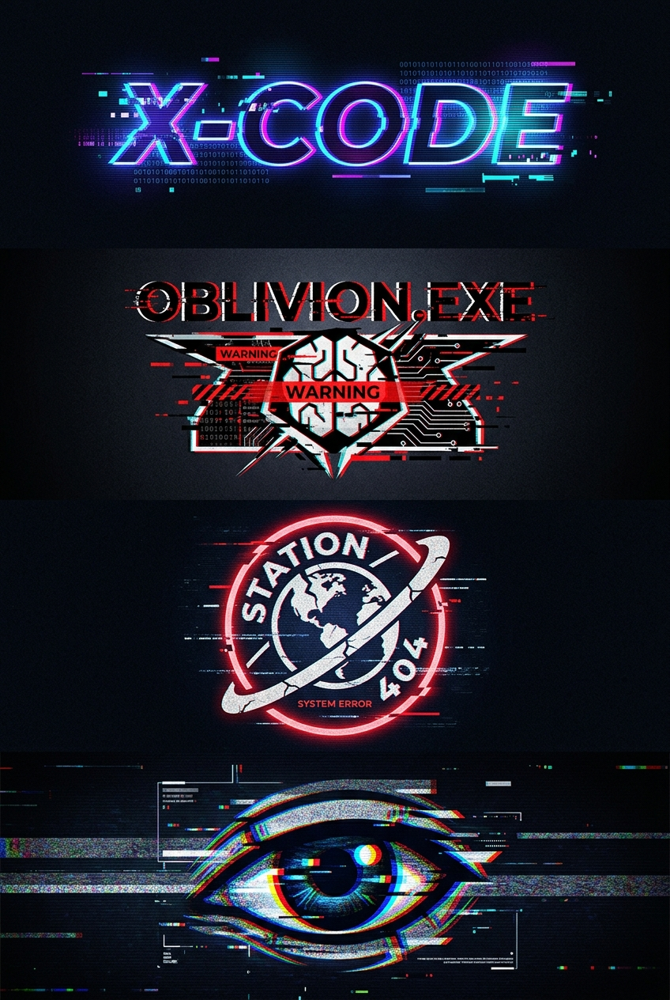

# 1、X-CODE In Futuristic Glitch Style, With

## Prompt

```text
1、"X-CODE" in futuristic glitch style, with pixel breakups and neon overlays 2、A glitch vector logo for a rogue AI named “OBLIVION.EXE”, with red error overlays and corrupted circuitry 3、A circular emblem for “Station 404”, a hacked orbital base with broken planetary symbols and static flicker 4、A surveillance eye logo, distorted with chromatic aberration, layered static, and flickering digital interference Aspect ratio 2:3. Style and mood: High-quality AI visual inspiration. Lighting: Balanced cinematic lighting. Composition: Vertical Pinterest-friendly composition. Detail level: high. High quality output, clean details.
```

## Model
- gemini-3.1-flash-image-preview

## Suggested Settings
- Aspect Ratio: 2:3
- Style / Mood: High-quality AI visual inspiration
- Lighting: Balanced cinematic lighting
- Composition: Vertical Pinterest-friendly composition
- Detail Level: high

## Copy-ready Prompt

```text
1、"X-CODE" in futuristic glitch style, with pixel breakups and neon overlays 2、A glitch vector logo for a rogue AI named “OBLIVION.EXE”, with red error overlays and corrupted circuitry 3、A circular emblem for “Station 404”, a hacked orbital base with broken planetary symbols and static flicker 4、A surveillance eye logo, distorted with chromatic aberration, layered static, and flickering digital interference Aspect ratio 2:3. Style and mood: High-quality AI visual inspiration. Lighting: Balanced cinematic lighting. Composition: Vertical Pinterest-friendly composition. Detail level: high. High quality output, clean details.

Rendering requirements:
- Aspect ratio: 2:3
- Style/Mood: High-quality AI visual inspiration
- Lighting: Balanced cinematic lighting
- Composition: Vertical Pinterest-friendly composition
- Detail level: high

Please keep strong consistency with the above settings.
```

## Image

